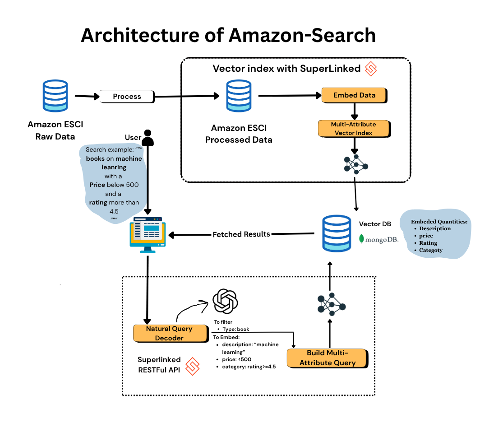

<div align="center">
  <h1>Amazon Semantic Search</h1>
</div>

<p align="center">
  
</p>

## 🏗️ Project Structure

```text
.
├── data/                                          # Directory where dataset files and processed data will be downloaded.
├── superlinked_app/                               # Main application source code
├── tools/                                         # Utility scripts and helper tools
├── .env                                           # Environment variables for local development
├── .env.example                                   # Template for environment variables
├── Makefile                                       # Running commands shortcuts(linux only)
├── environment.yml                                # Conda environment dependencies and metadata
└── requirements.txt                               # dependencies using pip
```

## 💾 Dataset

We will use the [ESCI-S: extended metadata for Amazon ESCI dataset](https://github.com/shuttie/esci-s?tab=readme-ov-file) dataset released under the Apache-2.0 license.

It is an e-commerce dataset on Amazon products. 

The full dataset references ~1.8M unique products. We will work with a sample of 4400 products to make everything lighter, but the code is compatible with the whole dataset.